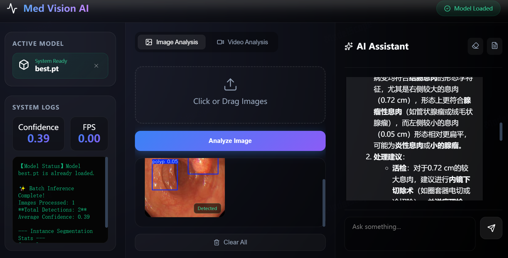
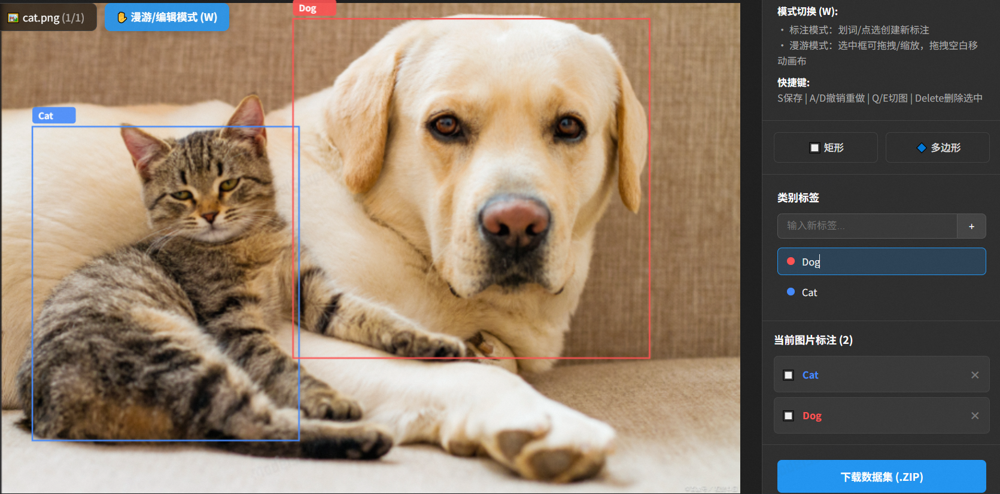
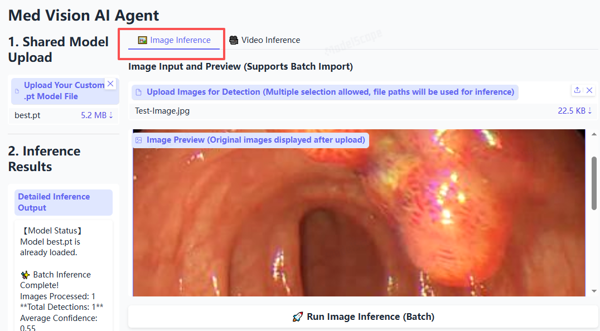
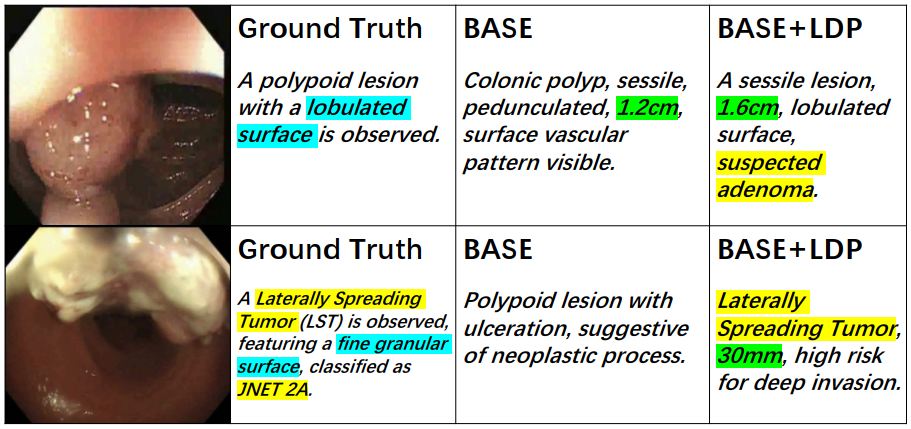

[](https://opensource.org/licenses/GPL-3.0)


# Med-Vision: A Large Multimodal Model for Medical Scene Understanding
### [Suncheng Xiang](https://JeremyXSC.github.io/), [Tianyu Zhou]()
### [Shanghai Jiao Tong University](https://en.sjtu.edu.cn/)

🤝Community Contributions: [[llama.cpp](https://github.com/ggerganov/llama.cpp/pull/3436)] [[Colab](https://github.com/camenduru/LLaVA-colab)] [[🤗Space](https://huggingface.co/spaces/badayvedat/LLaVA)] [[Replicate](https://replicate.com/yorickvp/llava-13b)] [[AutoGen](https://github.com/microsoft/autogen/blob/main/notebook/agentchat_lmm_llava.ipynb)]  [[BakLLaVA](https://github.com/SkunkworksAI/BakLLaVA)]

## Overview
In this work, we propose a novel framework named Med-Vision that leverages multi-modal large models for automated polyp diagnosis report generation. In particular, we construct a multimodal dataset comprising colonoscopy images and expert diagnostic texts, fine-tune the Qwen3-VL-Instruct model using parameter-efficient methods and further optimize it with Direct Preference Optimization. Extensive experiments demonstrate that our method outperforms existing approaches on both automated metrics and clinical expert evaluations, significantly reducing computational requirements while maintaining high performance.

****



[**[Paper]**](https://arxiv.org/pdf/2109.10498.pdf)   [**[Video Sample]**](https://www.youtube.com/watch?v=toR_73U9yLs)   [**[Related Project]**](https://JeremyXSC.github.io/GPR/)   [**[Demo]**](https://modelscope.cn/studios/Zaoshangzhou/Med-Vision-AI-Agent-v0.2/summary)  

</div> 


****
## 📣 NEWS 
- [11/2025] **Our 🚀Med-Vision AI Agent is publicly available online!**
- [12/2025] **Our 🚀Data Collector Agent is publicly available online!**

****
## Contents👀
- [Med-Vision Introduction](#Med-Vision Introduction)
- [Med-Vision Preparation](#Med-Vision Preparation)
- [Dataset Collection](#Dataset Collection)
- [Dataset Annotaion](#Dataset Annotation)
- [Image Inference](#image Inference)
- [Video Inference](#Video Inference)
- [AI Medical Consultation Report](#AI Medical Consultation Report)
- [Evaluation](#evaluation)


****
## Med-Vision Introduction
The Med-Vision solution is a novel framework named **Med-Vision** that leverages multi-modal large models for automated polyp diagnosis report generation, which is not only applicable to the static analysis of medical images but can also be seamlessly integrated into endoscopic examination equipment, providing real-time diagnostic assistance to doctors. Its high efficiency and accuracy contribute to improving the detection rate of early-stage polyps, reducing the risks of missed diagnoses and misdiagnoses. It offers strong support for the early screening and treatment of gastrointestinal diseases, thereby driving the development of smart healthcare.
<br>

****
## Med-Vision Preparation

#### A weight of Med-Vision can be downloaded from the following links:<br>
* Microsoft OneDrive:
    * [Download Link](https://1drv.ms/f/c/f90b38354a7cfaf5/IgB0EI_2kJ22Qr71S4_L3mjOAY5i3IiYPxM47q93eM6OSQs?e=Tdcok2)
    
* SJTU Yun Drive:
    * [Download Link](https://pan.sjtu.edu.cn/web/share/f90acb8af77b5e3ea396ce02cc067080) password: q41v
    


****
## Dataset Collection
As part of our large-scale data collection efforts, we implemented [DeepColl](https://modelscope.cn/studios/Zaoshangzhou/Dataset-Collector-v0.1), a specialized agent that enables efficient and bias-controlled sampling from heterogeneous sources (e.g. [Bing Search](https://www.bing.com/) and [Kaggle Library](https://www.kaggle.com/)), incorporating ethical AI frameworks to ensure compliance with GDPR and other data privacy regulations. More visual results is available as following:


****
## Dataset Annotation
Dataset labelling is the process of assigning meaningful and accurate labels or annotations to individual data points within a dataset. This crucial step involves human experts or automated algorithms carefully examining each data sample, such as images, text, audio, or video, and marking them with relevant categories, tags, or descriptions. The purpose of dataset labelling is to provide structured information that enables machine learning models to understand and learn from the data effectively. Well-labelled datasets are essential for training high-performance models, as they ensure that the algorithms can recognize patterns, make accurate predictions, and perform tasks with precision across various applications, ranging from image recognition and natural language processing to autonomous driving and medical diagnosis.



****
## Image Inference
Our Med-Vision agent supports the image inference.



****
## Video Inference
Our Med-Vision agent supports the video inference.

<video source="videos/Test-Video-Result.mp4" type="videos/Test-Video-Result.mp4" controls="controls" width="700px" ></video>

****
## AI Medical Consultation Report
Our Med-Vision agent also supports the medical report generation and treatment suggestion.



## Evaluation

In Med-Vision, we evaluate models on a diverse set of 3 benchmarks. To ensure the reproducibility, we evaluate the models with greedy decoding. We do not evaluate using beam search to make the inference process consistent with the chat demo of real-time outputs.

See [Evaluation.md](https://github.com/JeremyXSC/Med-Vision/blob/main/README.md).


                                
## Citation

If you find LLaVA useful for your research and applications, please cite using this BibTeX:

```
@article{zhou2025ldp,
  title={LDP: Parameter-Efficient Fine-Tuning of Multimodal LLM for Medical Report Generation},
  author={Zhou, Tianyu and Tang, Junyi and Li, Zehui and Qian, Dahong and Xiang, Suncheng},
  journal={arXiv preprint arXiv:2512.10750},
  year={2025}
}
```

```
@inproceedings{chen2023colo,
  title={Colo-scrl: Self-supervised contrastive representation learning for colonoscopic video retrieval},
  author={Chen, Qingzhong and Cai, Shilun and Cai, Crystal and Yu, Zefang and Qian, Dahong and Xiang, Suncheng},
  booktitle={2023 IEEE International Conference on Multimedia and Expo (ICME)},
  pages={1056--1061},
  year={2023},
  organization={IEEE}
}
```

```
@article{xiang2023towards,
  title={Towards discriminative representation with meta-learning for colonoscopic polyp re-identification},
  author={Xiang, Suncheng and Chen, Qingzhong and Cai, Shilun and Zhou, Chengfeng and Cai, Crystal and Du, Sijia and Zhang, Zhengjie and Zhong, Yunshi and Qian, Dahong},
  journal={arXiv preprint arXiv:2308.00929},
  year={2023}
}
```

```
@inproceedings{xiang2024vt,
  title={Vt-reid: Learning discriminative visual-text representation for polyp re-identification},
  author={Xiang, Suncheng and Liu, Cang and Ruan, Jiacheng and Cai, Shilun and Du, Sijia and Qian, Dahong},
  booktitle={ICASSP 2024-2024 IEEE International Conference on Acoustics, Speech and Signal Processing (ICASSP)},
  pages={3170--3174},
  year={2024},
  organization={IEEE}
}
```


****

## Ethical Considerations
Our task and dataset were created with careful attention to ethical questions, which we encountered throughout our work. Access to our dataset will be provided for research purposes only and with restrictions on redistribution. Furthermore, we are very cautious of human-annotation procedure of large scale datasets to avoid the social and ethical implications. 
As for Med-Vision system, governments and officials must establish strict regulations to control the usage of this technology since it mainly relies on (not all) surveillance data. Motivated by this, we do not consider the datasets for developing non-research systems without further professional processing or augmentation.

****

## LICENSE
- The Med-Vision are made available for non-commercial purposes only.
- You will not, directly or indirectly, reproduce, use, or convey the Colo-Pair dataset or any Content, or any work product or data derived therefrom, for commercial purposes.

Permissions of this strong copyleft license (GNU General Public License v3.0) are conditioned on making available complete source code of licensed works and modifications, which include larger works using a licensed work, under the same license. Copyright and license notices must be preserved. Contributors provide an express grant of patent rights.

****

## Acknowledgements
This research was supported by the National Natural Science Foundation of China under Project (Grant No. 62301315). We would like to thank authors of Tianyu Zhou for his hard work on this work. They provide tremendous efforts in these dataset to advance the research in this field. We also appreciate [Qingwei Zhang](https://www.youlai.cn/yyk/docindex/404902/doctorinfo.html), [Shilun Cai](https://www.youlai.cn/yyk/docindex/404902/doctorinfo.html) for insightful feedback and discussion.

****

For further questions and suggestions about our datasets and methods, please feel free to contact Suncheng Xiang:
xiangsuncheng17@sjtu.edu.cn.